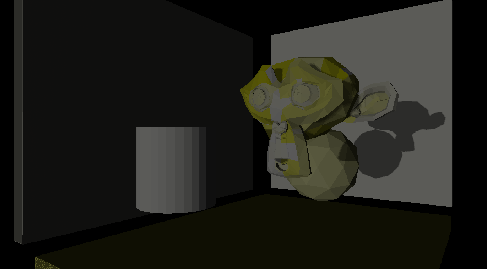

# RTIDPRR
A realtime implementation of Importance-Driven Progressive Refinement Radiosity on Vulkan.

  

## Dependencies

### Manual installation

- [Vulkan SDK](https://vulkan.lunarg.com/sdk/home#sdk/downloadConfirm/1.2.154.1/windows/VulkanSDK-1.2.154.1-Installer.exe)
- [vcpkg](https://github.com/microsoft/vcpkg)

### Install with vcpkg
- nlohmann-json:x64-windows                          3.9.1
- sdl2:x64-windows                                   2.0.12#5
- sdl2[vulkan]:x64-windows
- stb:x64-windows                                    2020-09-14
- tinygltf:x64-windows                               2020-07-28
- vulkan:x64-windows                                 1.1.82.1-1

